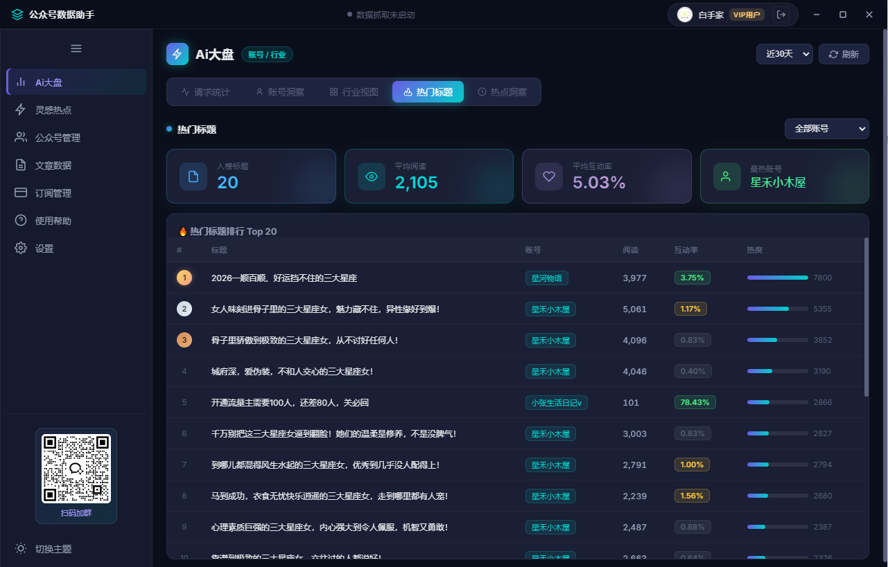
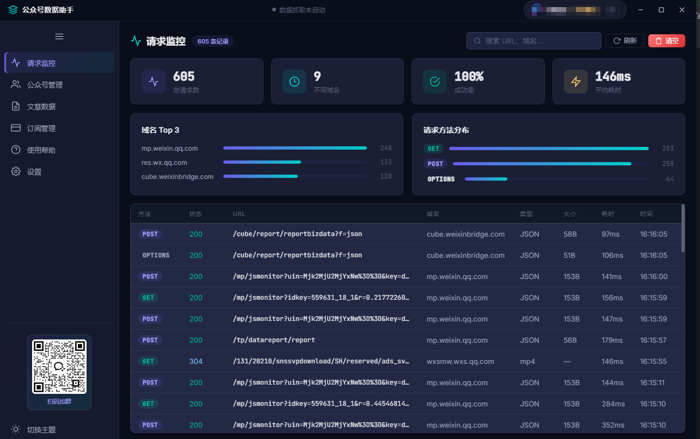
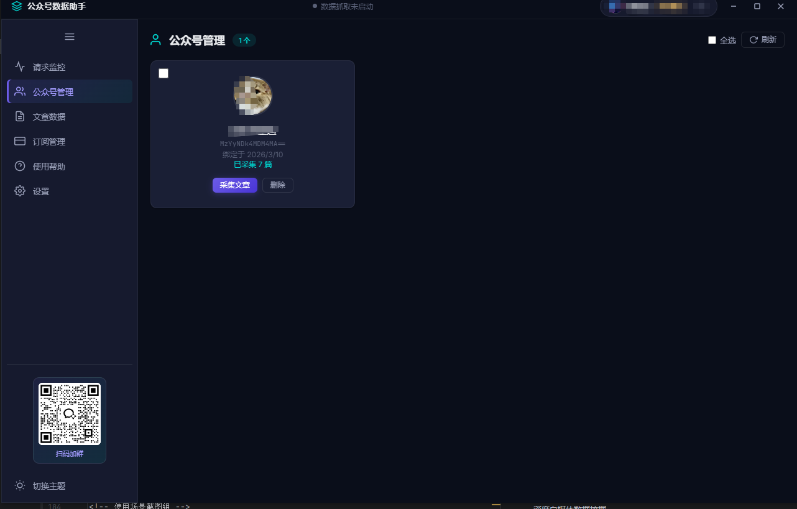
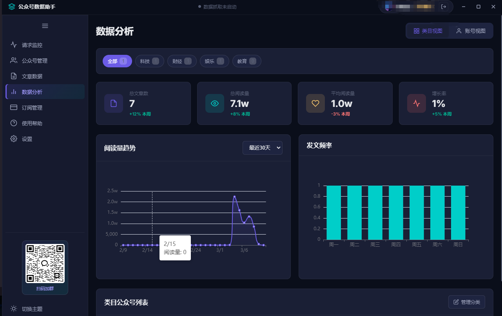
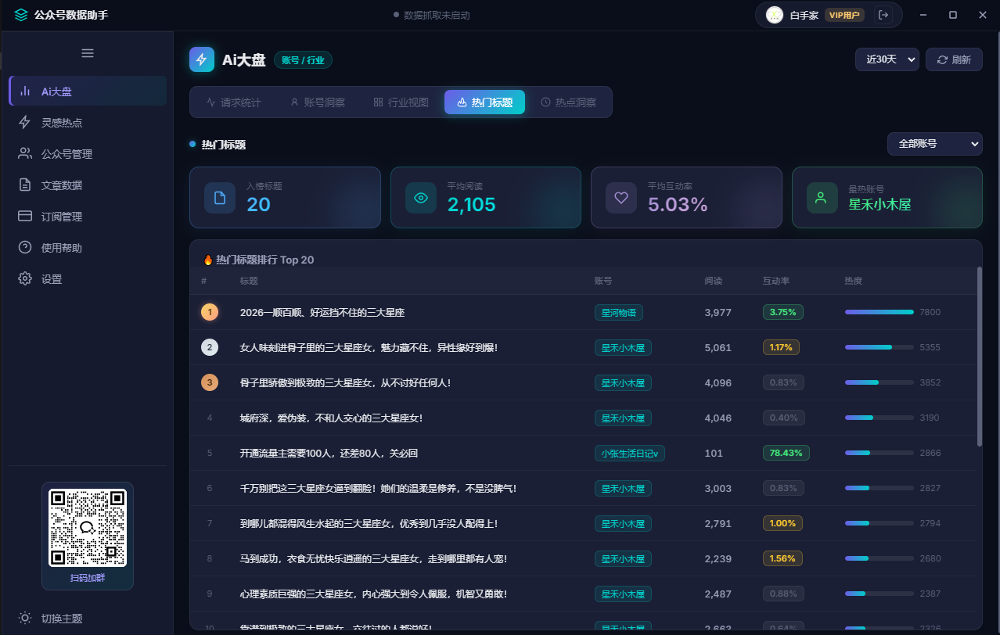
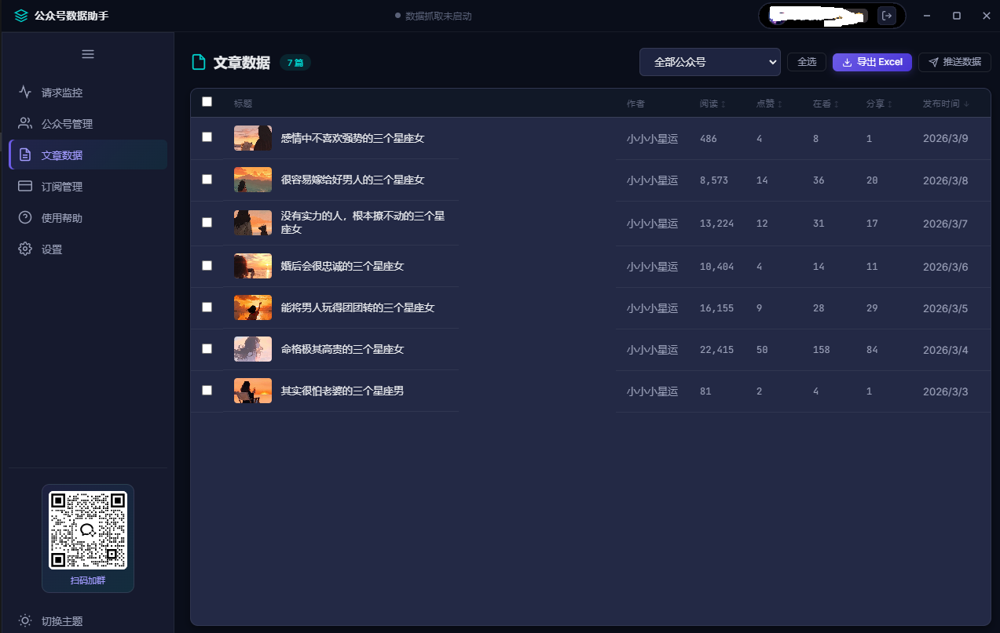
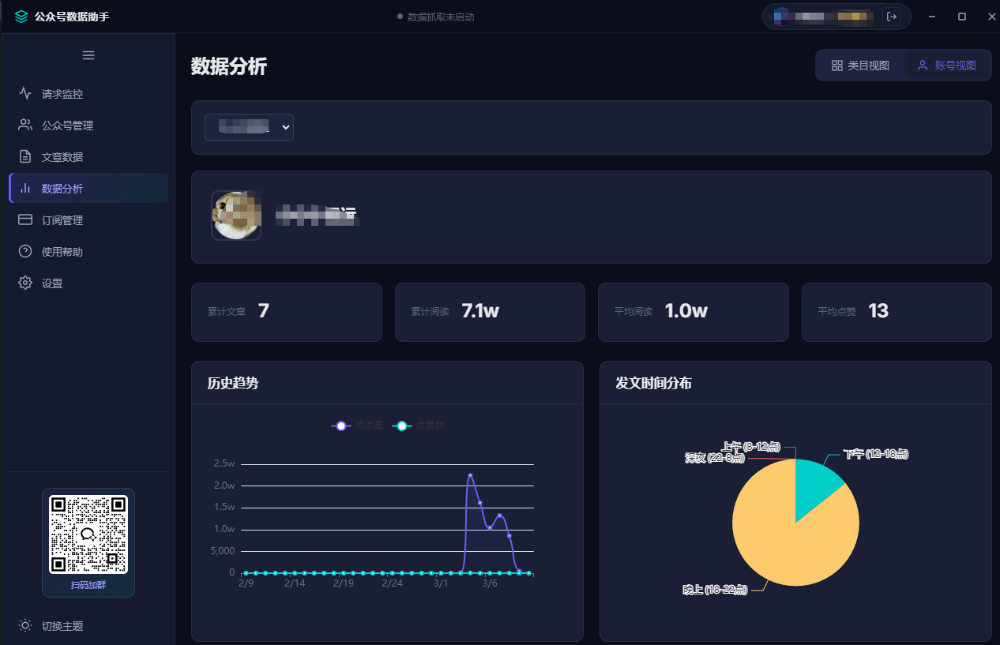
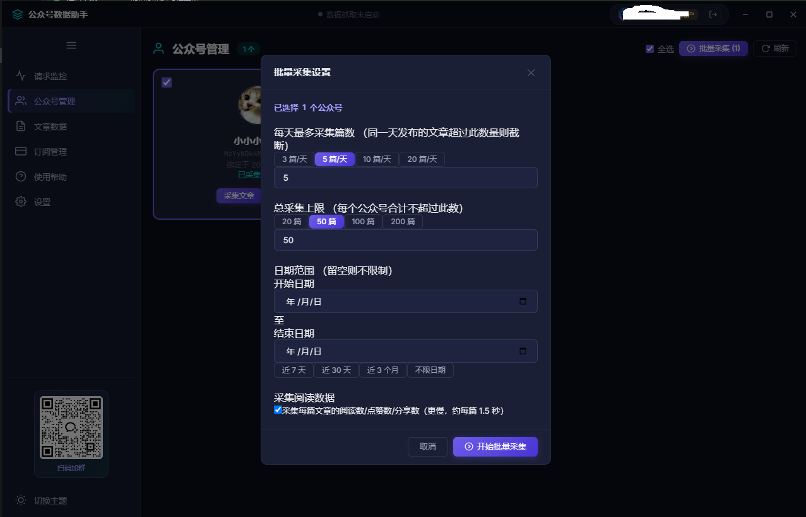

# 🚀 AI驱动的微信公众号数据助手

**专业的AI驱动数据采集分析工具 | 微信公众号 | 百家号 | 头条号**

*自媒体数据采集 • AI智能分析 • 多平台支持*

[🇨🇳 中文](#中文版本) | [�🇸 English](#english-version)

*选择您的首选语言版本*

<!-- 产品展示图片 -->

<!-- 功能演示图片 -->

**关键词**: AI数据分析, 微信公众号数据采集, 自媒体运营工具, 百家号数据分析, 头条号数据统计, WeChat Data Mining, Social Media Analytics

---

## 中文版本

## 🌟 为什么选择我们的AI数据采集工具？

### 🤖 **AI驱动的智能数据分析**
任意采集对标公众号数据，助力微信公众号、百家号、头条号等自媒体内容策略优化和AI内容创作。
支撑多账号监控批量采集，一键导出表格，自动推送到自己的服务器，无障碍对接到自己的项目。

<!-- 数据分析界面截图 -->

### ⚡ **多平台数据采集**
无缝采集多个自媒体平台数据 - 微信公众号、百度百家号、今日头条等。

<!-- 多平台支持展示图 -->

### 🔒 **企业级数据安全**
自媒体数据本地存储，AI加密保护，无云端风险，完全掌控您的数据资产。

### 🎯 **AI实时监控分析**
AI算法实时监控文章表现，智能预测热点趋势，优化自媒体运营策略。

<!-- 实时监控界面截图 -->

## ✨ 自媒体创作者专属AI功能

<!-- 功能特色展示图 -->

| 功能 | 描述 | 支持平台 |
|------|------|----------|
| 🤖 **AI数据采集** | 智能算法自动采集分析 | 微信公众号, 百家号, 头条号 |
| 📈 **多平台分析** | 跨平台数据对比分析 | 全平台自媒体支持 |
| 📊 **AI可视化** | AI生成图表和洞察报告 | 智能数据可视化 |
| 📤 **智能导出** | AI优化的数据导出 | Excel, CSV, PDF |
| 🔄 **实时同步** | 多平台数据实时更新 | 全平台同步 |
| 🎨 **现代界面** | 为自媒体创作者优化的界面 | 响应式设计 |

### 🚀 **支持的自媒体平台**
- ✅ **微信公众号** - 全功能数据采集
- ✅ **百家号** - 即将支持
- ✅ **头条号** - 即将支持
- ✅ **知乎** - 即将支持
- ✅ **小红书** - 即将支持
- ✅ **抖音** - 开发中

## 🎮 下载安装

**专业桌面应用，完整AI功能！**

👉 **[下载最新版本 (v1.0.5)](https://github.com/DNQtech/wecha_proxy/releases)** 👈

- ✅ 完整AI数据分析功能
- ✅ 多平台数据采集
- ✅ 专业自媒体分析仪表板
- ✅ 一键安装使用

### 📋 **安装指南**

1. **下载** 上方链接的安装程序
2. **右键管理员身份** 运行安装文件
3. **按照** 安装向导提示操作
4. **启动** 程序开始数据采集

## 📥 获取完整AI版本

### 🆓 **免费AI试用**
- 完整功能试用
- 多平台数据采集
- 完整自媒体分析功能

### 💎 **AI高级功能**
- ✅ 无限微信公众号管理
- ✅ 百家号&头条号数据采集
- ✅ 高级AI分析功能
- ✅ 跨平台数据洞察

## 🛠️ AI技术规格

- **AI引擎**: 先进机器学习算法
- **支持平台**: Windows 10/11, macOS (即将支持)
- **数据采集平台**: 微信公众号, 百家号, 头条号
- **技术支持**: 7×24小时

## 🎯 自媒体应用场景
### 📈 **自媒体运营团队**
- 微信公众号统一管理
- AI数据驱动内容策略
- 跨平台竞品分析对比

### 🏢 **企业新媒体部**
- 多平台品牌传播效果评估
- AI智能ROI数据分析
- 自动化定期报告制作

### 👥 **自媒体代运营公司**
- 客户多平台账号批量管理
- AI效果数据智能汇总
- 专业自媒体分析报告

### � **数据分析师**
- 深度自媒体数据挖掘
- AI趋势预测分析
- 智能可视化图表制作

## 🔥 自媒体创作者专享优惠

### 💥 **新用户AI体验包**

**立即注册享受：**
- 🎁 **功能免费试用**
- 🎯 **专属客服1对1指导**
- 🚀 **数据采集教程**

*限前100名自媒体创作者,给我start联系我可领取优惠！*

## 📞 立即开始

### 🎯 **准备好改变您的数据分析方式了吗？**

## 📞 联系我们

<!-- 微信群二维码 -->

*专业技术支持 • 用户交流 • 最新资讯• 更多更加*

---

## English Version

## � Why Choose Our AI-Powered Tool?

### 🤖 **AI-Driven Data Analysis**
Transform your WeChat Official Account, 百家号, and 头条号 data into actionable insights with our advanced AI analytics platform.

### ⚡ **Multi-Platform Data Collection**
Seamlessly collect data from multiple 自媒体 platforms - WeChat Official Accounts, Baidu Baijiahao, Toutiao, and more.

### 🔒 **Enterprise-Grade Security**
Your 自媒体 data stays on your device. No cloud storage, no privacy concerns, complete control over your information.

### 🎯 **Real-Time AI Monitoring**
AI-powered real-time tracking of article performance, engagement metrics, and audience behavior across all platforms.

## ✨ Core Features for 自媒体 Creators

| Feature | Description | Platforms Supported |
|---------|-------------|---------------------|
| 🤖 **AI Data Collection** | Smart data mining with AI algorithms | 微信公众号, 百家号, 头条号 |
| 📈 **Multi-Platform Analytics** | Cross-platform performance analysis | WeChat, Baidu, Toutiao |
| � **AI Visual Reports** | AI-generated charts and insights | All 自媒体 platforms |
| 📤 **Smart Export** | AI-optimized data export for reports | Excel, CSV, PDF |
| 🔄 **Real-Time Sync** | Live data updates across platforms | Multi-platform support |
| 🎨 **Modern Interface** | Clean, intuitive design for 自媒体 creators | Responsive design |

### � **Supported Platforms**
- ✅ **微信公众号** (WeChat Official Accounts)
- ✅ **百家号** (Baidu Baijiahao)  
- ✅ **头条号** (Toutiao/ByteDance)
- ✅ **知乎** (Zhihu) - Coming Soon
- ✅ **小红书** (Xiaohongshu) - Coming Soon

## � Download and Install

**Professional desktop application with full AI capabilities!**

👉 **[Download Latest Version (v1.0.5)](https://github.com/DNQtech/wecha_proxy/releases)** 👈

- ✅ Complete AI-powered data analysis
- ✅ Multi-platform data collection
- ✅ Professional 自媒体 analytics dashboard
- ✅ One-click installation

### 📋 **Installation Guide**
1. **Download** the installer from the link above
2. **Run** the setup file as administrator
3. **Follow** the installation wizard
4. **Launch** and start collecting data

## 📥 Get the Full AI Version

### 🆓 **Free AI Trial Available**
- 7-day full AI feature trial
- Multi-platform data collection
- Complete 自媒体 analytics access

### 💎 **AI Premium Features**
- ✅ Unlimited 微信公众号 management
- ✅ 百家号 & 头条号 data collection
- ✅ Advanced AI analytics
- ✅ Cross-platform insights
- ✅ Priority AI support

### 📦 **Easy Installation**
1. Download the installer
2. Run setup wizard
3. Start collecting data
4. Analyze and export

## 🏆 What 自媒体 Creators Say

> *"This AI tool saved me 10+ hours per week on 微信公众号 and 百家号 data collection. The AI insights helped us increase engagement by 40% across all platforms!"*
> 
> **— 自媒体运营总监, Tech Company**

> *"Finally, an AI tool that actually works for 头条号 and WeChat! Clean interface, powerful AI features, and excellent support. "*
> 
> **— Content Creator, 500K+ followers across platforms**

> *"The AI data analysis for 自媒体 platforms is incredible. It automatically identifies trending topics and optimal posting times!"*
> 
> **— Digital Marketing Agency**

## 🛠️ AI Technical Specifications

- **AI Engine**: Advanced machine learning algorithms
- **Platform**: Windows 10/11, macOS (coming soon)
- **Supported Platforms**: 微信公众号, 百家号, 头条号
- **Requirements**: 4GB RAM, 500MB storage
- **Languages**: 中文, English
- **AI Features**: Smart data mining, predictive analytics
- **Updates**: Automatic AI model updates
- **Support**: 24/7 AI-powered customer service

## 📞 Get Started Today

### 🎯 **Ready to Transform Your Data Analysis?**

---

### 🌟 **立即体验AI驱动的自媒体数据分析新时代！**

**热门标签**: #AI数据分析 #微信公众号 #百家号 #头条号 #自媒体运营 #数据采集 #内容营销 #社交媒体分析

**Made with ❤️ by Professional AI Development Team**

*© 2024 AI WeChat Data Assistant. All rights reserved.*

**SEO Keywords**: 微信公众号数据采集工具, AI自媒体分析, 百家号数据统计, 头条号运营工具, 自媒体数据挖掘, WeChat Official Account Analytics, Social Media Data Mining, AI Content Analysis

